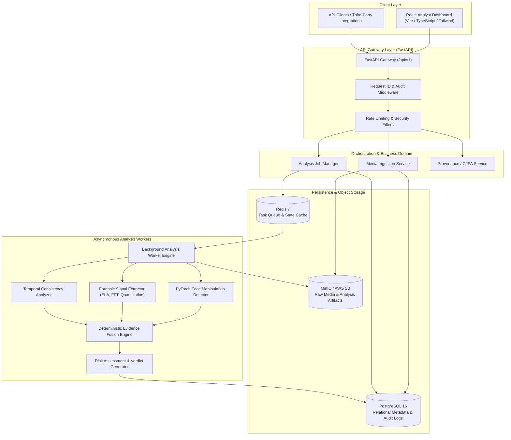
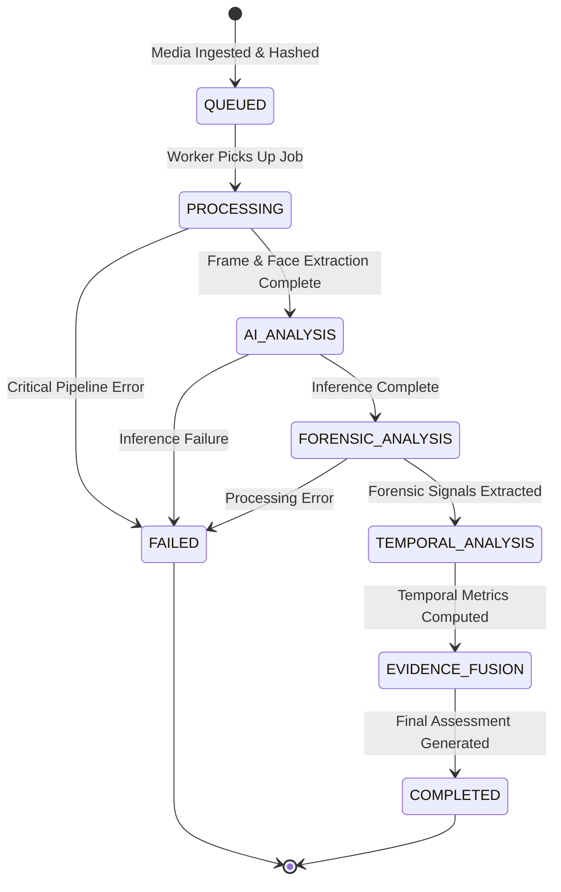
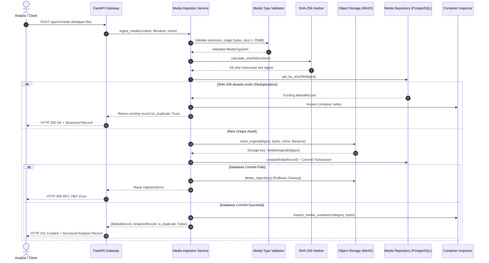
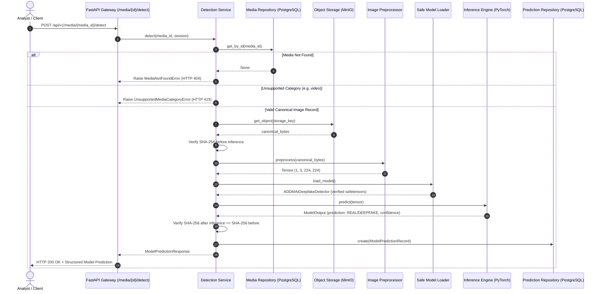

# ADDMAI System Architecture Specification

## 1. Executive Architecture Summary

**ADDMAI** (AI-Powered Deepfake Detection & Media Authenticity Intelligence) is designed as a modular, asynchronous, multi-signal authenticity analysis platform. The architecture departs from traditional brittle binary classifiers by treating media authenticity as a multi-source forensic assessment.

This document formalizes the system's structural components, inter-service communication protocols, data persistence layers, security perimeters, and lifecycle state machines established during **Stage 1 (Core Foundations & Infrastructure)**.

---

## 2. End-to-End System Topology



---

## 3. Layered Component Responsibilities

### 3.1 Presentation Layer (React Dashboard)
- **Role:** Web dashboard for analysts to upload assets, inspect forensic timelines, review Grad-CAM attention heatmaps, and download certified analysis summaries.
- **Rules:** Communicates solely via typed HTTP requests against `/api/v1`. Displays uncertainty intervals and never reports absolute certainty claims.

### 3.2 API Gateway Layer (FastAPI)
- **Base Path:** `/api/v1`
- **Lifespan Management:** Initializes application logging, verifies database and Redis connectivity, and coordinates graceful shutdowns.
- **Request Identification:** Emits and tracks `X-Request-ID` across every HTTP request and downstream worker task.
- **Error Standards:** Conforms to RFC-7807 (Problem Details for HTTP APIs).
- **Separation Rule:** Zero machine learning, OpenCV manipulation, or direct SQL execution within route handlers.
- **Service Layer Abstraction:** Route handlers (`apps/api/app/api/v1/health.py`) remain thin HTTP translation wrappers, delegating dependency inspection and readiness evaluation to dedicated domain services (`apps/api/app/services/health.py`).
- **Truthful Readiness Semantics:** The `/api/v1/ready` endpoint evaluates real TCP connectivity against PostgreSQL, Redis, and MinIO. It returns `HTTP 200` only when all configured services are reachable and returns `HTTP 503` if any service is down, without leaking credentials or internal URIs.

### 3.3 Persistence Layer
1. **PostgreSQL 16:**
   - Stores structured relational data: user accounts, media asset records, analysis jobs, extracted forensic signal values, model versions, and audit logs.
   - Large binary blobs (images, videos, face crops, tensor checkpoints) are strictly prohibited in database tables.
2. **MinIO / S3 Object Storage:**
   - Houses untrusted media uploads, sampled frame sequences, normalized face crops, Grad-CAM overlays, and generated PDF inspection reports.
   - Default buckets:
     - `addmai-uploads`: Raw ingested assets.
     - `addmai-artifacts`: Derived crops, frames, heatmaps, and evidence packages.
3. **Redis 7:**
   - Acts as high-throughput task broker for asynchronous processing and short-term job state caching.

### 3.4 Asynchronous Worker & Analysis Pipeline
Media analysis is compute-intensive and cannot block HTTP execution. Jobs are queued in Redis and processed asynchronously by background worker processes:
1. **Frame & Face Processing:** Samples video frames uniformly, isolates facial bounding boxes, and generates normalized crops.
2. **AI Inference:** Computes manipulation probabilities on face crops using fine-tuned computer vision backbones.
3. **Forensics:** Analyzes Error Level Analysis (ELA), Discrete Fourier Transform (DFT) frequency patterns, and compression boundary gradients.
4. **Temporal Consistency:** Tracks inter-frame landmarks, eye-blink dynamics, and motion continuity.
5. **Evidence Fusion:** Evaluates multi-signal inputs deterministically to produce a final verdict (`LIKELY_AUTHENTIC`, `LIKELY_MANIPULATED`, or `INCONCLUSIVE`).

---

## 4. Asynchronous Job State Machine



- **Controlled Retries:** Infrastructure-level failures (e.g., transient network disconnection to S3) allow up to 3 retries with exponential backoff.
- **Deterministic Failures:** Invalid media formatting, corrupt container headers, or unsupported codecs immediately terminate as `FAILED` without retrying.

---

## 5. Security & Threat Model

1. **Untrusted Uploads:**
   - Files are rejected if extensions do not match `.jpg`, `.jpeg`, `.png`, or `.mp4`.
   - MIME types are validated against whitelists before storage.
   - Storage keys are generated as random UUIDv4 identifiers, eliminating path traversal risks (`../../etc/passwd`).
2. **Resource Boundaries:**
   - Static Image Max Size: **15 MB**
   - Video File Max Size: **100 MB**
   - Video Duration Max: **60 seconds**
3. **Deterministic Cleanup:**
   - All frame decoding and temporary file generation on worker nodes must use managed temporary directories that guarantee deletion upon task completion or failure.
4. **Secrets & Credentials:**
   - Database credentials, S3 secret keys, and API tokens are injected exclusively via environment variables and validated through typed Pydantic models.

---

## 6. Observability & Telemetry

- **Structured JSON Logging:** All log entries conform to the schema:
  ```json
  {
    "timestamp": "2026-09-25T11:45:00.123456Z",
    "level": "INFO",
    "service": "addmai-api",
    "logger": "addmai.main",
    "message": "Media upload accepted",
    "request_id": "req_8f1c3a...",
    "job_id": "job_0b42f1..."
  }
  ```
- **Probes:**
  - `GET /api/v1/health`: Liveness probe indicating service execution.
  - `GET /api/v1/ready`: Readiness probe validating PostgreSQL, Redis, and MinIO connectivity.

---

## 7. Stage 2: Media Ingestion & Cryptographic Integrity Architecture

Stage 2 establishes the cryptographic and storage intake foundation for all incoming media assets prior to downstream analysis.

### 7.1 Ingestion Pipeline Sequence


### 7.2 Core Architectural Invariants
1. **Byte Preservation:** Raw bytes received over HTTP are preserved verbatim without re-encoding, transcoding, resizing, or EXIF stripping.
2. **Deterministic SHA-256 Digest:** Exactly 64 lowercase hexadecimal characters computed directly from original bytes. Serves as the immutable cryptographic identity of the asset.
3. **Canonical Deduplication Invariant:**
   $$\text{ONE SHA-256 Digest} \longrightarrow \text{ONE Canonical Original Object}$$
   If an uploaded file matches an existing SHA-256 digest, no duplicate storage object is created in MinIO, and no duplicate database record is created. The existing record is returned with `is_duplicate: true`.
4. **Deterministic Storage Keying:** Canonical object path pattern: `media/original/{sha256_digest}`.
5. **Neutral Forensic Observations:** Container properties (dimensions, duration, codecs, EXIF presence) are recorded purely as neutral observations. No authenticity verdicts or manipulation scores are generated.

### 7.3 Stage 2.1 Hardening Specifications

1. **Schema Authority & Table Invariants:**
   - **Alembic Authority:** Alembic migrations (`database/migrations/versions/`) represent the sole authoritative schema definition. `database/schema.sql` serves strictly as Docker bootstrap.
   - **Database Check Constraints:**
     - `ck_media_records_size_bytes_non_negative`: Enforces `size_bytes >= 0` at the database engine level.
     - `ck_media_records_media_category`: Restricts `media_category IN ('image', 'video')`.
2. **Concurrent Deduplication Race Handling:**
   - Database-level unique constraint on `sha256_digest` provides ACID serialization for simultaneous ingestion of identical payloads.
   - When concurrent requests race to persist the same digest, the losing transaction triggers an `IntegrityError`, executes an explicit `session.rollback()`, queries the canonical winning record, and returns it with `is_duplicate: true`.
   - The shared object storage key (`media/original/{sha256}`) is preserved without deletion during deduplication recovery.
3. **Defensive Parsing & Resource Boundaries:**
   - **Filename Sanitization:** Strips directory traversal sequences (`../`, `..\`), absolute paths, null bytes (`\x00`), and non-alphanumeric punctuation while enforcing a 255-character bound.
   - **Pillow Image Safety:** Disables truncated image recovery (`ImageFile.LOAD_TRUNCATED_IMAGES = False`), caps image pixels at 100M (`Image.MAX_IMAGE_PIXELS = 100_000_000`), and catches `DecompressionBombError` to prevent memory exhaustion.
   - **Bounded MP4 Container Parser:** Implements a pure-Python box parser with an iteration cap of 500 boxes and strict boundary validation against buffer overflow or infinite box recursion.
   - **Streaming Size Enforcement:** Request bodies are inspected via `Content-Length` headers and consumed in bounded 1 MB chunks to enforce the 25 MB inclusive limit before memory buffering.
4. **Storage & Database Consistency:**
   - Ingestion is structured with rollback compensation: if database persistence fails due to infrastructure errors, the freshly uploaded storage object is deleted (`storage_service.delete_object`) to prevent orphan objects.

---

## 8. Stage 3: AI Detection Engine Architecture

Stage 3 introduces localized, deep learning-based manipulation detection operating on canonical media assets produced by Stage 2.1.

### 8.1 Inference Pipeline Sequence


### 8.2 Model & Preprocessing Invariants
1. **Model Architecture:** MesoNet-4 inspired Convolutional Neural Network (`ADDMAIDeepfakeDetector`) with 4 convolutional blocks, batch normalization, max pooling, dropout regularization, and a single-logit classification head.
2. **Artifact Security:** Model weights are serialized in native `safetensors` format (`model.safetensors`, 98 KB), precluding arbitrary code execution vulnerabilities. The artifact checksum (`07059e48...`) is verified via SHA-256 prior to loading.
3. **Deterministic Preprocessing:** Raw in-memory bytes are decoded safely under strict decompression bomb limits (`MAX_IMAGE_PIXELS = 100_000_000`), converted to RGB, bicubic resized to `256 x 256`, center-cropped to `224 x 224`, and normalized using ImageNet channel coefficients (`mean=[0.485, 0.456, 0.406]`, `std=[0.229, 0.224, 0.225]`).
4. **Media Immutability Guarantee:** Preprocessing operates entirely on derived in-memory structures. The original storage object remains untouched, and the runtime guarantees:
   $$\text{SHA-256}_{\text{before inference}} = \text{SHA-256}_{\text{after inference}}$$
5. **Relational Persistence:** Predictions are stored in a dedicated `model_predictions` table linked 1:N with `media_records`. The canonical `media_records` entity is never mutated.
6. **Strict Constitutional Boundary:** Stage 3 outputs strictly `MODEL PREDICTION` (`REAL` or `DEEPFAKE`). It does **NOT** generate final authenticity assessments (`LIKELY_AUTHENTIC`, `LIKELY_MANIPULATED`, `INCONCLUSIVE`). Those are reserved for future multi-signal Evidence Fusion.


