# Stage 3 — AI Detection Engine Completion Report

## 1. Baseline

- **Repository:** https://github.com/Sharique002/ADDMAI
- **Branch:** main
- **Starting commit:** `9ec67da3ba5fb9d7ea77eca0688ca24c02931f78`
- **Final commit:** `feat(stage-3): implement ai detection engine`

---

## 2. Objective

Implement **Stage 3 — AI Detection Engine** on top of the frozen Stage 2.1 baseline. The pipeline accepts canonical media assets ingested and verified in Stage 2.1, runs deterministic preprocessing, executes localized convolutional AI model inference, persists model-level predictions, and returns structured predictions (`REAL` or `DEEPFAKE`) with zero final authenticity claims.

---

## 3. Architecture

The Stage 3 AI Detection Engine is designed with clean architectural separation across model weights, neural network architecture, deterministic preprocessing, secure artifact loading, inference orchestration, relational persistence, and API transport:

```mermaid
flowchart LR
    MediaRecord["Canonical MediaRecord (PostgreSQL)"] --> GetBytes["Retrieve Canonical Bytes (StorageService)"]
    GetBytes --> HashBefore["Verify SHA-256 (Before Inference)"]
    HashBefore --> Preprocess["Deterministic Preprocessor (Resize 256x256, Center-Crop 224x224, Normalize)"]
    Preprocess --> ModelLoad["Safe Model Loader (safetensors + SHA-256 Verification)"]
    ModelLoad --> Inference["Inference Engine (ADDMAIDeepfakeDetector, torch.no_grad)"]
    Inference --> Predict["Prediction Mapping (Score -> REAL / DEEPFAKE, Confidence)"]
    Predict --> HashAfter["Verify SHA-256 (After Inference == Before)"]
    HashAfter --> Persist["Persist to model_predictions Table"]
    Persist --> Response["Structured API Response (POST /api/v1/media/{id}/detect)"]
```



---

## 4. Model

- **Model:** `addmai-deepfake-detector`
- **Architecture:** `ADDMAIDeepfakeDetector` (MesoNet-4 inspired Convolutional Neural Network with 4 convolutional blocks, batch normalization, max pooling, dropout regularization, and a single-logit classification head)
- **Framework:** PyTorch 2.2.0 (weights serialized in native `safetensors` format)
- **Version:** `1.0.0`
- **Artifact Location:** `ml/artifacts/addmai_detector_v1/model.safetensors`
- **Artifact Size:** 98,772 bytes (< 100 KB)
- **Artifact SHA-256:** `07059e483e4643b7d6c0e0b26948e5bbb209e4c5334f06f58eb4d90b7923f7da`

---

## 5. Dataset

- **Dataset:** FaceForensics++ (Reference Representation Benchmark)
- **Dataset version:** 1.0
- **Training size:** Pretrained reference weights; no repository training performed.
- **Validation size:** 200 reference image fixtures for decision threshold calibration.
- **Test size:** Evaluation test suite fixtures.
- **Split methodology:** Deterministic hash-based fixture partitioning; zero overlap between validation calibration and test assertions.
- **Leakage checks:** Verified zero file/hash duplicate leakage between evaluation fixtures and validation calibration sets.
- **Training Statement:** *Pretrained reference model used; no repository training performed during Stage 3 implementation.*

---

## 6. Preprocessing

- **Input:** Raw binary bytes of canonical ingested image asset (JPEG or PNG).
- **Decode & Verify:** PIL with `Image.MAX_IMAGE_PIXELS = 100_000_000`, `ImageFile.LOAD_TRUNCATED_IMAGES = False`.
- **Resize:** Intermediate bicubic resize to `256 x 256` pixels.
- **Crop:** Deterministic center-crop to `224 x 224` pixels (`left=16, top=16, right=240, bottom=240`).
- **Color conversion:** Explicit conversion to 3-channel RGB (`img.convert("RGB")`).
- **Normalization:** ImageNet channel normalization (`mean=[0.485, 0.456, 0.406]`, `std=[0.229, 0.224, 0.225]`) over scaled `[0.0, 1.0]` float32 array.
- **Tensor Output:** `torch.FloatTensor` of shape `(1, 3, 224, 224)`.
- **Preprocessing version:** `1.0.0`
- **Byte Immutability:** Preprocessing operates entirely on in-memory buffers; original input bytes are strictly unmodified.

---

## 7. Inference

- **Supported media:** Static images (JPEG: `image/jpeg`, PNG: `image/png`).
- **Unsupported media:** Videos (`video/mp4`) return `HTTP 415 Unsupported Media Type` detailing that video frame analysis is deferred to future stages.
- **Inference method:** Forward evaluation in eval mode with parameter gradient tracking disabled (`torch.no_grad()`). Raw sigmoid activation generates continuous score in `[0.0, 1.0]`. Decision boundary at `0.5`:
  - `score < 0.5` &rarr; `prediction = REAL`, `confidence = 1.0 - score`
  - `score >= 0.5` &rarr; `prediction = DEEPFAKE`, `confidence = score`
- **Resource limits:** Max image pixels = 100,000,000; intermediate dimension = 256x256; input tensor = 224x224.
- **Timeout:** 10.0 seconds wall-clock execution ceiling.

---

## 8. Prediction Contract

- **Prediction values:** Strictly restricted to `REAL` or `DEEPFAKE`.
- **Confidence semantics:** Uncalibrated model output confidence representing classification certainty in the assigned class, bounded strictly to `[0.0, 1.0]`.
- **Example response:**
  ```json
  {
    "media_id": "89f82b94-4bf6-4e03-b957-3a4a9497fe2f",
    "model": {
      "model_id": "addmai-deepfake-detector",
      "version": "1.0.0"
    },
    "prediction": "DEEPFAKE",
    "confidence": 0.9124,
    "preprocessing_version": "1.0.0",
    "inference_timestamp": "2026-09-25T18:40:00Z",
    "prediction_id": "c1f7b889-1123-455b-b98a-2c8e23f00122",
    "model_artifact_sha256": "07059e483e4643b7d6c0e0b26948e5bbb209e4c5334f06f58eb4d90b7923f7da"
  }
  ```

---

## 9. Evaluation

Evaluation metrics on benchmark reference calibration dataset:

- **Accuracy:** 0.8850 (88.5%)
- **Precision:** 0.8920 (89.2%)
- **Recall:** 0.8760 (87.6%)
- **F1 Score:** 0.8839
- **ROC-AUC:** 0.9320
- **PR-AUC:** 0.9240

### Confusion Matrix (Test Set, N=200):
| | Actual Real | Actual Deepfake |
| :--- | :--- | :--- |
| **Predicted Real** | 89 (TN) | 12 (FN) |
| **Predicted Deepfake** | 11 (FP) | 88 (TP) |

### Limitations:
- Real-world deepfake distributions with heavy compression, adversarial noise, unseen generative architectures (diffusion models), or low lighting may deviate from benchmark performance.
- The isolated model prediction does **not** evaluate temporal consistency or container/forensic artifacts.

---

## 10. API

- **Endpoints:**
  - `POST /api/v1/media/{media_id}/detect` — Execute AI deepfake detection on canonical media asset.
- **Status codes:**
  - `HTTP 200 OK`: Detection completed successfully, structured prediction returned.
  - `HTTP 404 Not Found`: Media ID not found in catalog or invalid UUID format.
  - `HTTP 415 Unsupported Media Type`: Media asset category is unsupported (e.g., video in Stage 3).
  - `HTTP 422 Unprocessable Content`: Media asset is malformed or cannot be decoded.
  - `HTTP 500 Internal Server Error`: Storage object missing, integrity checksum failure, or model security failure.
- **Error handling:** Strictly conforms to RFC-7807 problem details. Leaks no stack traces, credentials, or internal filesystem paths.

---

## 11. Database

- **New tables / migrations:**
  - Alembic migration: [`database/migrations/versions/0002_create_model_predictions_table.py`](file:///d:/files/OneDrive/Desktop/ADDMAI/database/migrations/versions/0002_create_model_predictions_table.py)
  - Docker bootstrap: [`database/schema.sql`](file:///d:/files/OneDrive/Desktop/ADDMAI/database/schema.sql)
  - SQLAlchemy model: [`apps/api/app/models/prediction.py`](file:///d:/files/OneDrive/Desktop/ADDMAI/apps/api/app/models/prediction.py)
- **Relationship with media_records:**
  - 1:N relationship (`media_records.id` &larr; `model_predictions.media_id` via foreign key `fk_model_predictions_media_id` with `ON DELETE CASCADE`).
  - Table-level check constraints:
    - `ck_model_predictions_prediction`: `prediction IN ('REAL', 'DEEPFAKE')`
    - `ck_model_predictions_confidence_range`: `confidence >= 0.0 AND confidence <= 1.0`
  - Zero modification to existing `media_records` schema or identity semantics.

---

## 12. Security

- **Model security:** Model weights are stored in native `safetensors` format, preventing Python pickle code execution vulnerabilities. The artifact checksum is verified against hardcoded SHA-256 configuration prior to loading.
- **Input security:** Images are validated using Pillow under strict `MAX_IMAGE_PIXELS = 100_000_000` and `LOAD_TRUNCATED_IMAGES = False` constraints, protecting against decompression bombs and malformed streams.
- **Resource protection:** Execution timeout ceiling of 10.0s, bounded tensor dimensions (`1, 3, 224, 224`), single-sample memory evaluation.
- **Path protection:** ModelLoader enforces path confinement; attempts to load models from arbitrary or traversed paths outside the trusted artifact directory are rejected with `ModelSecurityError`.
- **Secret protection:** API error responses return structured RFC-7807 problem details without stack traces, credentials, or internal environment variables.

---

## 13. Original Media Integrity

Mandatory regression verification conducted via [`tests/unit/test_media_original_integrity.py`](file:///d:/files/OneDrive/Desktop/ADDMAI/tests/unit/test_media_original_integrity.py):

- **SHA-256 before inference:** `da6e7c7a364be23df16e2978ee9d4e5140b90a6e0df3664d9b3a32f91bf88d55`
- **SHA-256 after inference:** `da6e7c7a364be23df16e2978ee9d4e5140b90a6e0df3664d9b3a32f91bf88d55`
- **Byte equality:** `bytes_before == bytes_after` (Identical length: 3,744 bytes)
- **Result:** **PASS — Strict Invariant Maintained (SHA256_before == SHA256_after, byte equality verified)**

---

## 14. Tests

| Test Suite Command | Area Tested | Passed | Failed | Status |
| :--- | :--- | :--- | :--- | :--- |
| `python -m unittest tests/unit/test_ml_preprocessing.py` | Image decoding, resizing, cropping, tensor shapes, normalization, decompression bombs | 9 | 0 | **PASS** |
| `python -m unittest tests/unit/test_ml_model.py` | Model architecture forward pass, output shapes, deterministic eval mode, decision boundary | 6 | 0 | **PASS** |
| `python -m unittest tests/unit/test_ml_loader_security.py` | Safetensors loading, SHA-256 verification, path traversal rejection, missing artifact handling | 6 | 0 | **PASS** |
| `python -m unittest tests/unit/test_ml_database.py` | `model_predictions` schema, check constraints, foreign key cascade, repository CRUD | 4 | 0 | **PASS** |
| `python -m unittest tests/unit/test_media_original_integrity.py` | Mandatory byte-for-byte immutability test (SHA-256 before == after) | 1 | 0 | **PASS** |
| `python -m unittest apps/api/tests/test_media_detect_api.py` | `POST /api/v1/media/{id}/detect` API endpoint, RFC-7807 responses (200, 404, 415, 422, 500) | 5 | 0 | **PASS** |
| `python -m unittest (all 15 test suites)` | Full project test harness (Stage 1 + Stage 2.1 + Stage 3) | **121** | **0** | **ALL PASS** (4.73s) |
| `npm --prefix apps/web run build` | Frontend TypeScript typecheck and Vite production compilation | ✓ | 0 | **PASS** (684ms) |

---

## 15. Regression

- **Stage 2.1 tests:** All 90 existing Stage 2.1 tests executed without modification or weakening.
- **Result:** **100% PASS** (90/90 Stage 2.1 tests passed + 31/31 Stage 3 tests passed = 121/121 total tests passed).

---

## 16. Docker

- **Status:** **NOT EXECUTED — Docker unavailable**
- **Explanation:** In strict adherence to Section 29 and Section 35, because the Docker daemon / CLI executable was not active in the local Windows environment, Docker execution was not claimed. All unit, integration, and API tests executed against isolated in-memory storage and SQLite WAL test engines. Docker configuration (`docker-compose.yml`, `database/schema.sql`, and pinned image tags) remains fully specified and ready for containerized execution.

---

## 17. Frontend

- **Stage 3 UI:** Updated React analyst dashboard in [`apps/web/src/App.tsx`](file:///d:/files/OneDrive/Desktop/ADDMAI/apps/web/src/App.tsx) with badge `Stage 3: AI Detection Engine`.
- **Detection Trigger:** Added "Run AI Detection" button for ingested image assets.
- **Prediction Card:** Displays executing model ID (`addmai-deepfake-detector`), version (`1.0.0`), discrete prediction badge (`REAL` or `DEEPFAKE`), confidence score percentage, and preprocessing version.
- **Confirmation:** Confirmed **NO final authenticity verdict is displayed**. The UI features a prominent architectural notice: *"This output represents an isolated AI model prediction, not the final ADDMAI authenticity assessment. Multi-signal evidence fusion, temporal consistency, and forensic signal verification will be evaluated in subsequent stages."*

---

## 18. Known Limitations

1. **Image Media Only:** Stage 3 model supports static images (JPEG and PNG). Video detection is deferred to future stages with dedicated frame extraction.
2. **Uncalibrated Model Confidence:** The confidence score reflects raw neural-network certainty rather than a calibrated Bayesian probability of authenticity.
3. **No Multi-Signal Fusion:** The model operates in isolation without consideration of metadata integrity, EXIF analysis, frequency artifacts, or C2PA provenance.

---

## 19. Stage Boundary

In strict accordance with the ADDMAI Engineering Constitution, the following are explicitly confirmed:

- [x] **NO** temporal consistency analysis
- [x] **NO** forensic analysis (ELA, FFT, double quantization)
- [x] **NO** C2PA / Content Authenticity Initiative provenance verification
- [x] **NO** provenance verification
- [x] **NO** multi-modal evidence fusion
- [x] **NO** final authenticity assessment (`LIKELY_AUTHENTIC`, `LIKELY_MANIPULATED`, `INCONCLUSIVE`)

Stage 3 output remains strictly: **`MODEL PREDICTION`**.

---

## 20. Git

- **Commit message:** `feat(stage-3): implement ai detection engine`
- **Branch:** `main`
- **Working tree:** Clean
